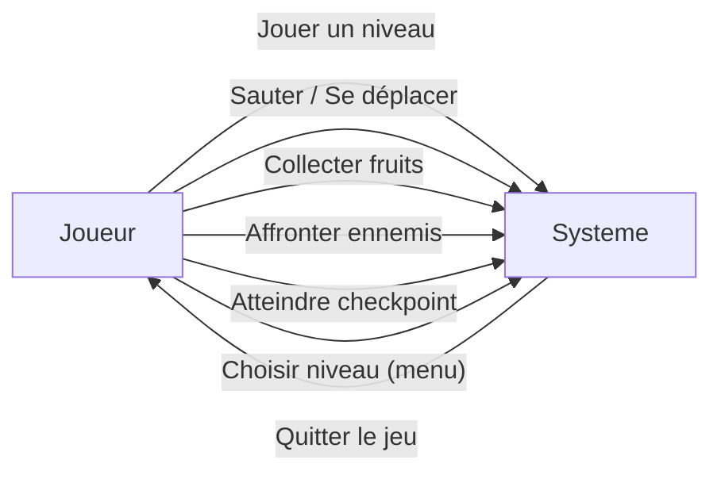
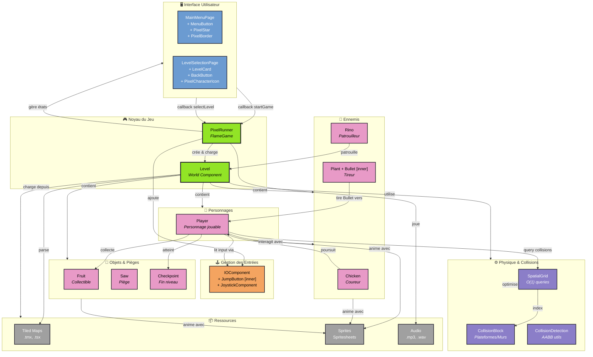
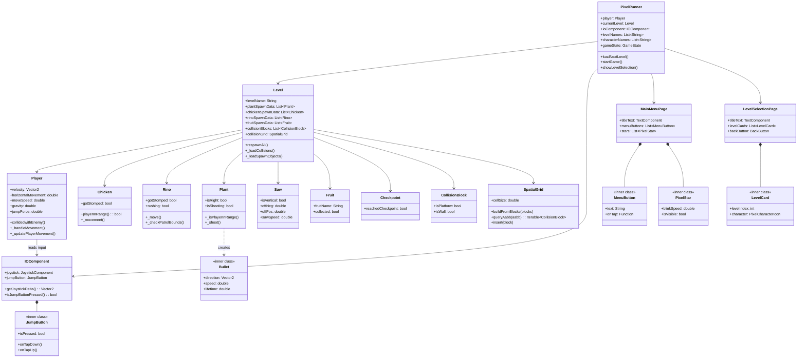
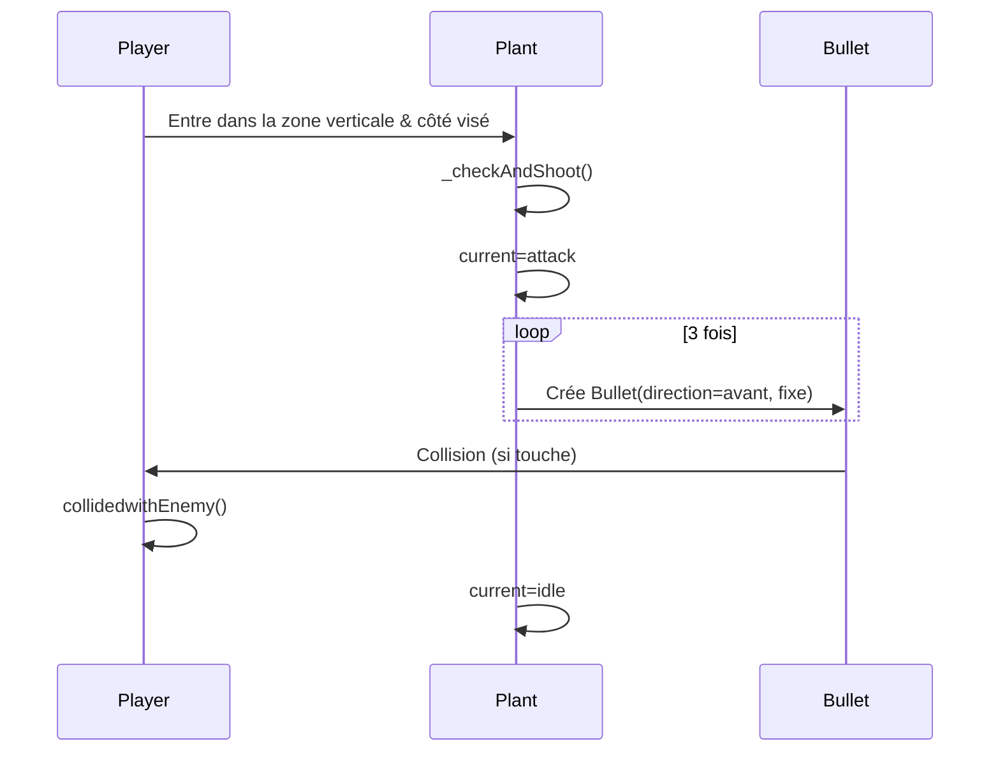
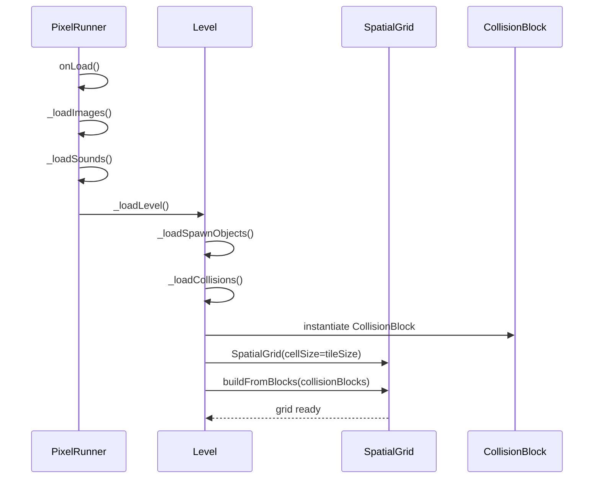
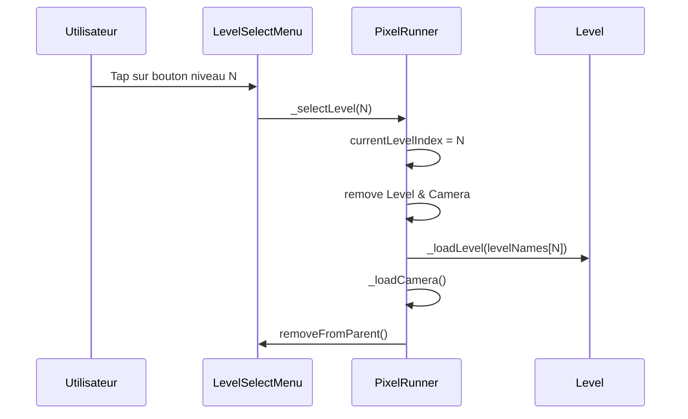
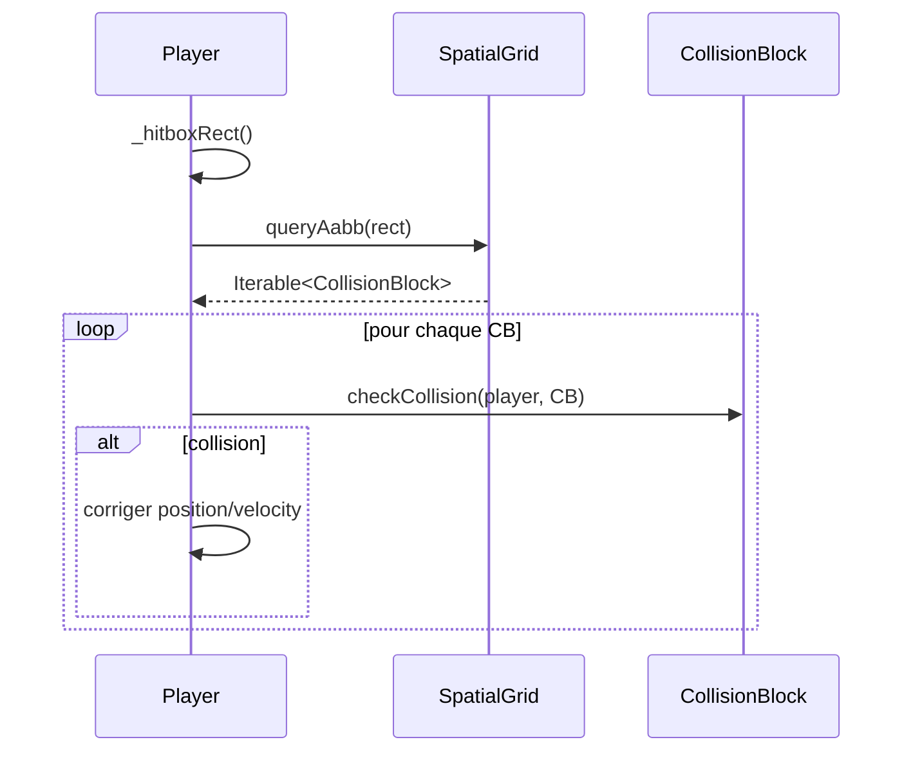

# PixelRunner — Rapport de Projet

## Page de titre
- **Titre du projet**: PixelRunner
- **Équipe**: À compléter
- **Encadrant**: À compléter
- **Semestre**: À compléter
- **Établissement**: À compléter

---

## Résumé / Abstract
PixelRunner est un jeu de plateforme 2D pixellisé développé avec Flutter et Flame, jouable sur mobile, desktop et web. Le joueur parcourt des niveaux, évite des pièges (scies), affronte des ennemis (Chicken, Rino, Plant), collecte des fruits et atteint le checkpoint final. Le projet met l’accent sur des animations fluides, une intégration Tiled pour la création de niveaux, et des mécaniques de tir/interaction (Plant tire trois projectiles en rafales, vers l’avant). Le jeu propose un menu qui premet de sélection de niveaux au démarrage qui de quitter l’application par un simple tap. Résultats: plusieurs niveaux complets, optimisation des performances, réutilisation d’assets, sélection de niveau et écran de fin.

---

## Table des matières
1. [Introduction](#introduction)
2. [Analyse des besoins](#analyse-des-besoins)
3. [Spécifications / Cahier des charges](#spécifications--cahier-des-charges)
4. [Conception et architecture](#conception-et-architecture)
  - [Gestion des collisions (Spatial Grid)](#gestion-des-collisions-spatial-grid)
  - [Sélection de niveau (Menu)](#sélection-de-niveau-menu)
  - [Écran de remerciement](#écran-de-remerciement)
5. [Développement et réalisation](#développement-et-réalisation)
6. [Tests et validation](#tests-et-validation)
7. [Conclusion et perspectives](#conclusion-et-perspectives)
8. [Bibliographie / Références](#bibliographie--références)
9. [Annexes](#annexes)

---

## Introduction
- **Contexte**: Développement d’un jeu 2D multiplateforme, rapide à itérer et facile à distribuer.
- **Problématique**: Proposer des mécaniques classiques (saut, collision, ennemis, tir) avec un pipeline d’assets et de niveaux efficace.
- **Motivation**: Apprentissage de Flutter + Flame, structuration de composants, intégration d’outils (Tiled), et optimisation des performances.
- **Objectifs**: Créer 2–3 niveaux complets, intégrer plusieurs ennemis, gérer le respawn, offrir une sélection de niveaux et un écran de fin.

---

## Analyse des besoins
- **Utilisateurs**: Joueurs casuals sur mobile/desktop; développeurs souhaitant étendre les niveaux.
- **Fonctionnalités attendues**:
  - Déplacement (joystick, bouton saut), collisions, gravité, plateaux.
  - Ennemis variés: Chicken (course), Rino (patrouille), Plant (tir en rafales).
  - Collectibles (fruits), checkpoints, respawn.
  - Sélecteur de niveaux (menu), écran de remerciement.
- **Contraintes techniques**:
  - Flutter + Flame, intégration Tiled (`.tmx`), assets spritesheet.
  - Performances cohérentes: timestep fixe, limitation itérations physiques.
  - Multi-plateforme (Android, iOS, Windows, macOS, Web).

---

## Spécifications / Cahier des charges
### Fonctionnalités minimales
- Déplacement, saut, collisions avec blocs et plateformes.
- Chargement de niveaux via Tiled, par couches et objets.
- Ennemis de base et mort par “stomp”.
- Collecte de fruits et validation du checkpoint.

### Fonctionnalités optionnelles
- Ennemis supplémentaires (Plant avec tir en rafales).
- Sélecteur de niveaux (menu) et écran de remerciement.
- Optimisations (limitation itérations physiques, contrôle des animations).

### Diagramme de cas d’utilisation (Mermaid)

```mermaid
flowchart LR
    Joueur --"Jouer un niveau"--> Systeme
    Joueur --"Sauter / Se déplacer"--> Systeme
    Joueur --"Collecter fruits"--> Systeme
    Joueur --"Affronter ennemis"--> Systeme
    Joueur --"Atteindre checkpoint"--> Systeme
    Joueur --"Choisir niveau (menu)"--> Systeme
    Systeme --"Quitter le jeu"--> Joueur
```

---

## Conception et architecture
- **Choix technologiques**:
  - Multiplateforme via **Flutter**; moteur de jeu **Flame** (sprites, collisions, animations).
  - **Tiled** pour conception des niveaux; assets pixellisés.
  - Audio via **flame_audio** (SFX, BGM).
- **Organisation par composants**:
  - Architecture modulaire avec **classes internes** pour améliorer la cohésion
  - `PixelRunner.dart` (Game principal), `Level.dart` (monde Tiled), `Player.dart`
  - Ennemis: `Chicken.dart`, `Rino.dart`, `Plant.dart` (+ `Bullet` comme classe interne)
  - UI: `MainMenuPage.dart` (+ `MenuButton`, `PixelStar`, `PixelBorder` comme classes internes)
  - UI: `LevelSelection.dart` (+ `LevelCard`, `PixelCharacterIcon`, `BackButton` comme classes internes)
  - IO: `IOComponent.dart` (+ `JumpButton` comme classe interne)
  
- **Principe d'organisation des classes internes**:
  - Les classes auxiliaires étroitement liées à une fonctionnalité sont définies dans le même fichier
  - Avantages: meilleure encapsulation, réduction de la fragmentation, cohésion renforcée
  - Exemples: `Bullet` est interne à `Plant` car elle n'existe que pour les tirs du Plant
  - `JumpButton` est interne à `IOComponent` car elle fait partie du système d'entrée

- **Architecture runtime**:
  - Au démarrage: chargement des images/sons, affichage du `LevelSelectMenu`.
  - Sélection d'un niveau → création de `Level` et `CameraComponent` (résolution fixe 640×360).
  - BGM via `FlameAudio.bgm.play('bgm.mp3')`.
  - Fin de progression → (tap pour quitter).

### Diagramme de composants (architecture)

```mermaid
graph TB
    subgraph Core["🎮 Noyau du Jeu"]
        PR["PixelRunner<br/><i>FlameGame</i>"]
        LVL["Level<br/><i>World Component</i>"]
    end
    
    subgraph UI["🖥️ Interface Utilisateur"]
        MM["MainMenuPage<br/>+ MenuButton<br/>+ PixelStar<br/>+ PixelBorder"]
        LS["LevelSelectionPage<br/>+ LevelCard<br/>+ BackButton<br/>+ PixelCharacterIcon"]
    end
    
    subgraph Input["🕹️ Gestion des Entrées"]
        IOC["IOComponent<br/>+ JumpButton [inner]<br/>+ JoystickComponent"]
    end
    
    subgraph Characters["👤 Personnages"]
        PLY["Player<br/><i>Personnage jouable</i>"]
    end
    
    subgraph Enemies["👾 Ennemis"]
        CHK["Chicken<br/><i>Coureur</i>"]
        RIN["Rino<br/><i>Patrouilleur</i>"]
        PLT["Plant + Bullet [inner]<br/><i>Tireur</i>"]
    end
    
    subgraph Items["🎁 Objets & Pièges"]
        FRT["Fruit<br/><i>Collectible</i>"]
        SAW["Saw<br/><i>Piège</i>"]
        CHP["Checkpoint<br/><i>Fin niveau</i>"]
    end
    
    subgraph Physics["⚙️ Physique & Collisions"]
        SG["SpatialGrid<br/><i>O(1) queries</i>"]
        CB["CollisionBlock<br/><i>Plateformes/Murs</i>"]
        CD["CollisionDetection<br/><i>AABB utils</i>"]
    end
    
    subgraph Resources["📦 Ressources"]
        TLD["Tiled Maps<br/>.tmx, .tsx"]
        SPR["Sprites<br/>Spritesheets"]
        SND["Audio<br/>.mp3, .wav"]
    end

    %% Relations principales
    PR -->|gère états| UI
    PR -->|crée & charge| LVL
    PR -->|ajoute| IOC
    
    UI -->|callback startGame| PR
    UI -->|callback selectLevel| PR
    
    LVL -->|contient| Characters
    LVL -->|contient| Enemies
    LVL -->|contient| Items
    LVL -->|utilise| Physics
    LVL -->|charge depuis| Resources
    
    PLY -->|lit input via| IOC
    PLY -->|query collisions| SG
    PLY -->|interagit avec| Enemies
    PLY -->|collecte| FRT
    PLY -->|atteint| CHP
    
    CHK -->|poursuit| PLY
    RIN -->|patrouille| LVL
    PLT -->|tire Bullet vers| PLY
    
    SG -->|index| CB
    SG -->|optimise requêtes| Physics
    
    LVL -->|parse| TLD
    Characters -->|anime avec| SPR
    Enemies -->|anime avec| SPR
    Items -->|anime avec| SPR
    PR -->|joue| SND

    %% Styling
    classDef coreStyle fill:#92E426,stroke:#1A1826,stroke-width:3px,color:#000
    classDef uiStyle fill:#6B9BD1,stroke:#1A1826,stroke-width:2px,color:#fff
    classDef inputStyle fill:#F4A460,stroke:#1A1826,stroke-width:2px,color:#000
    classDef entityStyle fill:#E89AC7,stroke:#1A1826,stroke-width:2px,color:#000
    classDef physicsStyle fill:#8B7EC8,stroke:#1A1826,stroke-width:2px,color:#fff
    classDef resourceStyle fill:#A0A0A0,stroke:#1A1826,stroke-width:2px,color:#fff
    
    class PR,LVL coreStyle
    class MM,LS uiStyle
    class IOC inputStyle
    class PLY,CHK,RIN,PLT entityStyle
    class FRT,SAW,CHP entityStyle
    class SG,CB,CD physicsStyle
    class TLD,SPR,SND resourceStyle
```

### Diagramme de classes (Vue d'ensemble)

```mermaid
classDiagram
  class PixelRunner{
    +player: Player
    +currentLevel: Level
    +ioComponent: IOComponent
    +levelNames: List~String~
    +characterNames: List~String~
    +gameState: GameState
    +loadNextLevel()
    +startGame()
    +showLevelSelection()
  }
  
  class Level{
    +levelName: String
    +plantSpawnData: List~Plant~
    +chickenSpawnData: List~Chicken~
    +rinoSpawnData: List~Rino~
    +fruitSpawnData: List~Fruit~
    +collisionBlocks: List~CollisionBlock~
    +collisionGrid: SpatialGrid
    +respawnAll()
    +_loadCollisions()
    +_loadSpawnObjects()
  }
  
  class Player{
    +velocity: Vector2
    +horizontalMovement: double
    +moveSpeed: double
    +gravity: double
    +jumpForce: double
    +collidedwithEnemy()
    +_handleMovement()
    +_updatePlayerMovement()
  }
  
  class IOComponent{
    +joystick: JoystickComponent
    +jumpButton: JumpButton
    +getJoystickDelta(): Vector2
    +isJumpButtonPressed(): bool
  }
  
  class JumpButton{
    <<inner class>>
    +isPressed: bool
    +onTapDown()
    +onTapUp()
  }
  
  class Chicken{
    +gotStomped: bool
    +playerInRange(): bool
    +_movement()
  }
  
  class Rino{
    +gotStomped: bool
    +rushing: bool
    +_move()
    +_checkPatrolBounds()
  }
  
  class Plant{
    +isRight: bool
    +isShooting: bool
    +_isPlayerInRange()
    +_shoot()
  }
  
  class Bullet{
    <<inner class>>
    +direction: Vector2
    +speed: double
    +lifetime: double
  }
  
  class MainMenuPage{
    +titleText: TextComponent
    +menuButtons: List~MenuButton~
    +stars: List~PixelStar~
  }
  
  class MenuButton{
    <<inner class>>
    +text: String
    +onTap: Function
  }
  
  class PixelStar{
    <<inner class>>
    +blinkSpeed: double
    +isVisible: bool
  }
  
  class LevelSelectionPage{
    +titleText: TextComponent
    +levelCards: List~LevelCard~
    +backButton: BackButton
  }
  
  class LevelCard{
    <<inner class>>
    +levelIndex: int
    +character: PixelCharacterIcon
  }
  
  class CollisionBlock{
    +isPlatform: bool
    +isWall: bool
  }
  
  class SpatialGrid{
    +cellSize: double
    +buildFromBlocks(blocks)
    +queryAabb(aabb): Iterable~CollisionBlock~
    +insert(block)
  }
  
  class Saw{
    +isVertical: bool
    +offNeg: double
    +offPos: double
    +sawSpeed: double
  }
  
  class Fruit{
    +fruitName: String
    +collected: bool
  }
  
  class Checkpoint{
    +reachedCheckpoint: bool
  }

  PixelRunner --> Level
  PixelRunner --> IOComponent
  PixelRunner --> MainMenuPage
  PixelRunner --> LevelSelectionPage
  Level --> Player
  Level --> Chicken
  Level --> Rino
  Level --> Plant
  Level --> Saw
  Level --> Fruit
  Level --> Checkpoint
  Level --> CollisionBlock
  Level --> SpatialGrid
  Plant ..> Bullet: creates
  IOComponent *-- JumpButton
  MainMenuPage *-- MenuButton
  MainMenuPage *-- PixelStar
  LevelSelectionPage *-- LevelCard
  Player --> IOComponent: reads input
```

### Organisation des classes internes (Architecture fichiers)

Le projet utilise une organisation où certaines classes auxiliaires sont définies comme **classes internes** dans le même fichier que leur classe principale. Cette approche améliore la cohésion et réduit la fragmentation du code:

| Fichier | Classe Principale | Classes Internes | Rôle |
|---------|------------------|------------------|------|
| `IOComponent.dart` | `IOComponent` | `JumpButton` | Gestion des entrées (joystick + bouton) |
| `Plant.dart` | `Plant` | `Bullet` | Ennemi tireur + projectile |
| `MainMenuPage.dart` | `MainMenuPage` | `MenuButton`, `PixelStar`, `PixelBorder` | Menu principal + éléments UI |
| `LevelSelection.dart` | `LevelSelectionPage` | `LevelCard`, `PixelCharacterIcon`, `BackButton`, `PixelStar` | Sélection de niveau + cartes |

**Avantages de cette approche**:
- **Encapsulation forte**: Les classes internes sont étroitement liées à leur conteneur
- **Réduction de la complexité**: Moins de fichiers à naviguer
- **Cohésion**: Logique connexe groupée ensemble
- **Accès simplifié**: Les classes internes peuvent accéder aux membres de la classe parente

**Convention utilisée**:
- Classes internes marquées `<<inner class>>` dans les diagrammes UML
- Notation `<<inner class of Parent>>` pour indiquer la dépendance explicite
- Relation de composition (`*--`) pour montrer que la classe interne fait partie intégrante de la classe parente

### Diagramme de séquence (tir du Plant)

```mermaid
sequenceDiagram
  participant P as Player
  participant PL as Plant
  participant B as Bullet

  P->>PL: Entre dans la zone verticale & côté visé
  PL->>PL: _checkAndShoot()
  PL->>PL: current=attack
  loop 3 fois
    PL->>B: Crée Bullet(direction=avant, fixe)
  end
  B->>P: Collision (si touche)
  P->>P: collidedwithEnemy()
  PL->>PL: current=idle
```

### Diagramme de séquence (initialisation avec SpatialGrid)

```mermaid
sequenceDiagram
  participant G as PixelRunner
  participant L as Level
  participant SG as SpatialGrid
  participant CB as CollisionBlock

  G->>G: onLoad()
  G->>G: _loadImages()
  G->>G: _loadSounds()
  G->>L: _loadLevel()
  L->>L: _loadSpawnObjects()
  L->>L: _loadCollisions()
  L->>CB: instantiate CollisionBlock
  L->>SG: SpatialGrid(cellSize=tileSize)
  L->>SG: buildFromBlocks(collisionBlocks)
  SG-->>L: grid ready
```

### Diagramme de séquence (sélection de niveau)

```mermaid
sequenceDiagram
  participant U as Utilisateur
  participant M as LevelSelectMenu
  participant G as PixelRunner
  participant L as Level

  U->>M: Tap sur bouton niveau N
  M->>G: _selectLevel(N)
  G->>G: currentLevelIndex = N
  G->>G: remove Level & Camera
  G->>L: _loadLevel(levelNames[N])
  G->>G: _loadCamera()
  G->>M: removeFromParent()
```

### Diagramme de séquence (détection collision via SpatialGrid)

```mermaid
sequenceDiagram
  participant P as Player
  participant SG as SpatialGrid
  participant CB as CollisionBlock

  P->>P: _hitboxRect()
  P->>SG: queryAabb(rect)
  SG-->>P: Iterable<CollisionBlock>
  loop pour chaque CB
    P->>CB: checkCollision(player, CB)
    alt collision
      P->>P: corriger position/velocity
    end
  end
```

---

## Développement et réalisation
- **Modules**:
  - Chargement assets et niveaux (`images.loadAllImages`, Flame/Tiled).
  - Composants ennemis et collisions (`CollisionCallbacks`).
  - Sélecteur de niveaux et écran de remerciement.
  - Physique pas fixe avec garde (limitation des itérations pour éviter spirales de lag).
  - **SpatialGrid**: index des `CollisionBlock` par cellules (O(1) requête par rectangle).
- **Captures d’écran**: À insérer (menu, gameplay, Plant tir).
- **Extraits code significatifs**:
```dart
// Plant: détection verticale + tir vers l’avant (rafale x3)
bool _isPlayerInRange() {
  final playerTop = game.player.y;
  final playerBottom = game.player.y + game.player.height;
  final plantHeadY = position.y;
  final plantBaseY = position.y + height;
  final playerCenterX = game.player.x + game.player.width * 0.5;
  final plantCenterX = position.x + width * 0.5;
  final correctSide = isRight ? (playerCenterX > plantCenterX)
                                 : (playerCenterX < plantCenterX);
  final verticalOverlap = playerBottom > plantHeadY && playerTop < plantBaseY;
  return correctSide && verticalOverlap;
}

void _shoot() async {
  isShooting = true;
  timeSinceLastShot = 0;
  current = PlantState.attack;
  final plantCenter = position + Vector2(width * .5, height * .5);
  final forward = (isRight) ? Vector2(1, 0) : Vector2(-1, 0);
  
  for (int i = 0; i < 3; i++) {
    if (gotStomped || parent == null) break;
    // Création de la classe interne Bullet
    parent?.add(Bullet(position: plantCenter.clone(), direction: forward));
    if (i < 2) await Future.delayed(const Duration(milliseconds: 120));
  }
}

// Classe interne: Bullet - Projectile (définie dans Plant.dart)
class Bullet extends SpriteComponent
    with HasGameReference<PixelRunner>, CollisionCallbacks {
  final Vector2 direction;
  final double speed = 150.0;
  
  Bullet({required Vector2 position, required this.direction});
  
  @override
  void update(double dt) {
    position += direction * speed * dt;
  }
}
```

#### Exemple 2: IOComponent avec classe interne JumpButton
```dart
// IOComponent.dart - Gestion des entrées utilisateur
class IOComponent extends Component with HasGameReference<PixelRunner> {
  late JoystickComponent joystick;
  late JumpButton jumpButton;

  @override
  FutureOr<void> onLoad() async {
    joystick = JoystickComponent(/* ... */);
    add(joystick);
    
    jumpButton = JumpButton(); // Classe interne
    add(jumpButton);
  }
}

// Classe interne JumpButton (dans IOComponent.dart)
class JumpButton extends SpriteComponent
    with HasGameReference<PixelRunner>, TapCallbacks {
  bool isPressed = false;

  @override
  void onTapDown(TapDownEvent event) {
    isPressed = true;
    game.player.hasJumped = true;
  }
}
```

### Organisation du dépôt (structure détaillée)
```
assets/
  audio/ (jump.wav, collect_fruit.wav, hit.wav, bounce.wav, bgm.mp3)
  images/
    Background/ (Blue.png, Brown.png, Gray.png, ...)
    Enemies/ (Chicken, Rino, Plant sprites)
    HUD/ (Joystick.png, Knob.png, JumpButton.png)
    Items/ (Fruits sprites)
    Main Characters/ (Ninja Frog, Mask Dude, Pink Man)
    Menu/
      Buttons/ (Play, Previous, Next, Restart, ...)
      Levels/ (01.png → 50.png - icônes niveaux)
      Text/ (Text (White/Black) (8x10).png)
    Terrain/ (Terrain sprites)
    Traps/ (Saw sprites)
  tiles/ (level_01.tmx, level_02.tmx, pixel_adventure.tsx)

lib/
  main.dart
  PixelRunner.dart (GameState enum + PixelRunner class principale)
  
  Componenets/
    ConstVars.dart (constantes globales)
    
    EntityComponents/
      Level.dart (Level - gestion monde Tiled)
      
      Player/
        Player.dart (Player - personnage jouable)
      
      Enemies/
        Chicken.dart (Chicken - ennemi coureur)
        Rino.dart (Rino - ennemi patrouilleur)
        Plant.dart (Plant + Bullet [inner] - ennemi tireur + projectile)
      
      Collectables/
        Fruit.dart (Fruit - collectible)
      
      Traps/
        Saw.dart (Saw - piège rotatif)
      
      PlatformingElements/
        CollisionBlock.dart (CollisionBlock - blocs de collision)
        Checkpoint.dart (Checkpoint - point de fin de niveau)
    
    IOcomponents/
      IOComponent.dart (IOComponent + JumpButton [inner])
    
    UIcomponents/
      MainMenuPage.dart (MainMenuPage + MenuButton, PixelStar, PixelBorder [inner])
      LevelSelection.dart (LevelSelectionPage + LevelCard, PixelCharacterIcon, BackButton, PixelStar [inner])
    
    PhysicsComponents/
      SpatialGrid.dart (SpatialGrid - optimisation collisions O(1))
      CollisionDetection.dart (utilitaires collision AABB)
      CustomHitBox.dart (hitbox personnalisée)
```

**Légende**: 
- `[inner]` = classe interne définie dans le même fichier
- Fichiers avec classes multiples organisés pour maximiser la cohésion

### Intégration Tiled
- Calques: `SpawnPoints` (player, ennemis, items…), `Collisions` (blocs, plateformes).
- Objets: propriétés lues via `spawnPoint.properties.getValue(...)`.
- Respawn: listes de données (`fruitSpawnData`, `chickenSpawnData`, `plantSpawnData`, ...).

## Gestion des collisions (Spatial Grid)
- **Principe**: grille de taille `tileSize`; insertion des `CollisionBlock` dans les cellules qu’ils recouvrent.
- **Requête**: `queryAabb(Rect)` retourne l’ensemble des blocs dans les cellules intersectées.
- **Complexité**: O(1) en pratique (nombre de cellules constant par hitbox), vs O(n) si parcours naïf.

```dart
// SpatialGrid: construction & requête
final grid = SpatialGrid(cellSize: tileSize);
grid.buildFromBlocks(collisionBlocks);

final rect = Rect.fromLTWH(x, y, w, h);
for (final block in grid.queryAabb(rect)) {
  if (checkCollision(player, block)) {
    // résolution
  }
}
```

### Build & Run
```
flutter run
```

---

## Tests et validation
- **Scénarios de test**:
  - Déplacement/jump sur plateformes; collisions et gravité stables.
  - Stomp sur Chicken/Rino; mort en 1 coup; respawn correct.
  - Plant: tir en rafales (3), détection verticale + côté, projectiles droits.
  - Collecte fruits → checkpoint valide → progression niveau.
  - Menu de sélection: choix niveau et chargement correct.
  - Écran remerciement: affichage et sortie sur tap.
- **Résultats**: Comportements vérifiés sur plusieurs plateformes; performances stables (timestep fixe, itérations capées).
- **Problèmes rencontrés & solutions**:
  - Animations ne se réinitialisaient pas: ajout `reset()` + `animationTicker.reset()`.
  - Saw bloquée: correction des bornes (clamp, inversion).
  - Detection de collision couteuse O(n) => spatial grid (O(1))
  - l'aqusition d'un score supeieur a 1 lors de la detection de la collision avec les fruits: utilisation de OnCollionStart au lieu de OnConllision (detection continue). 

---

## Conclusion et perspectives
- **Bilan**: Objectifs principaux atteints; pipeline d’assets/niveaux maîtrisé; mécaniques clés implémentées.
- **Améliorations**:
  - Plus d’ennemis/obstacles, power-ups, boss.
  - Sauvegarde de progression, scores, classements.
  - Effets sonores/musiques supplémentaires.

---

## Bibliographie / Références
- Flame Engine Docs: https://flame-engine.org
- Flutter Docs: https://docs.flutter.dev
- Tiled Map Editor: https://www.mapeditor.org
- PixelFrog Pixel Adventure assets on itch.io 

---

## Annexes
- Diagrammes UML détaillés.
- Documentation des assets (dimensions sprites, noms de fichiers).
- Captures supplémentaires.
