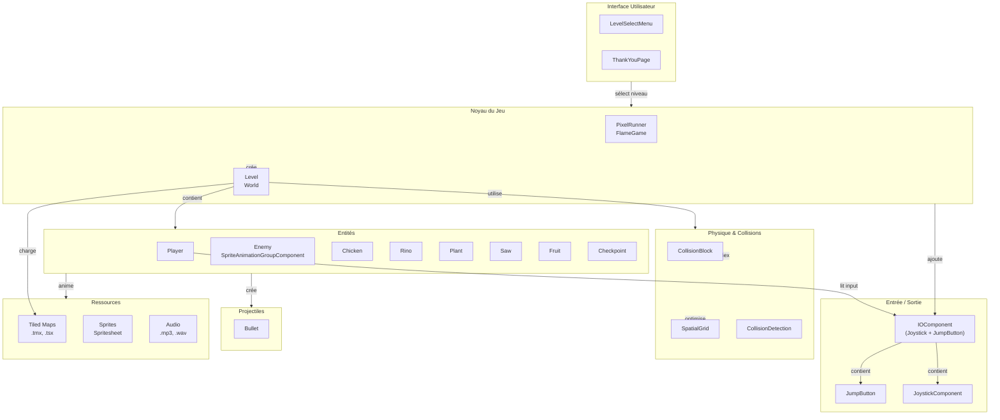
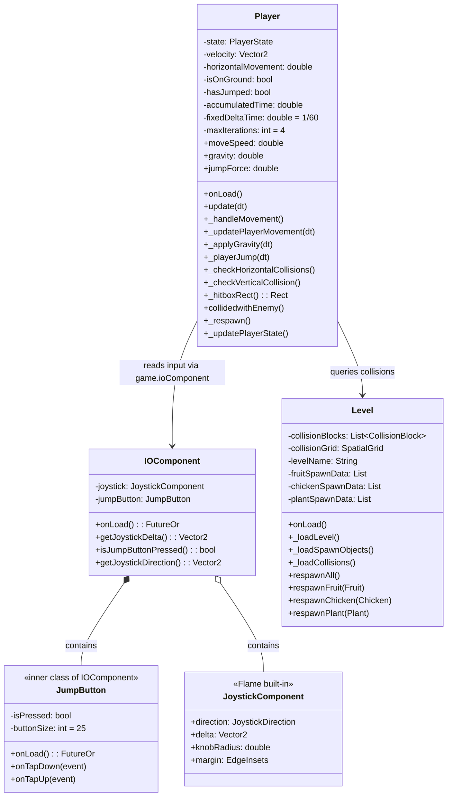
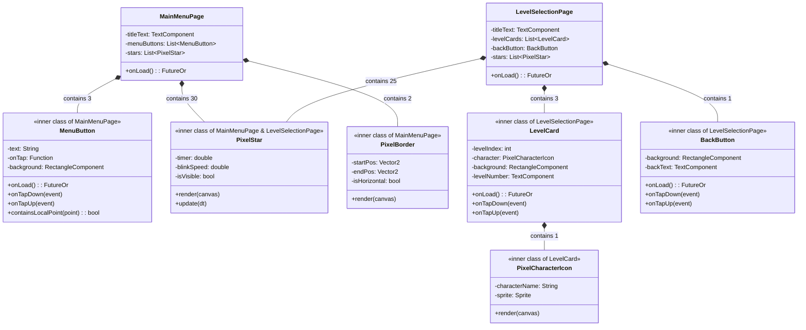
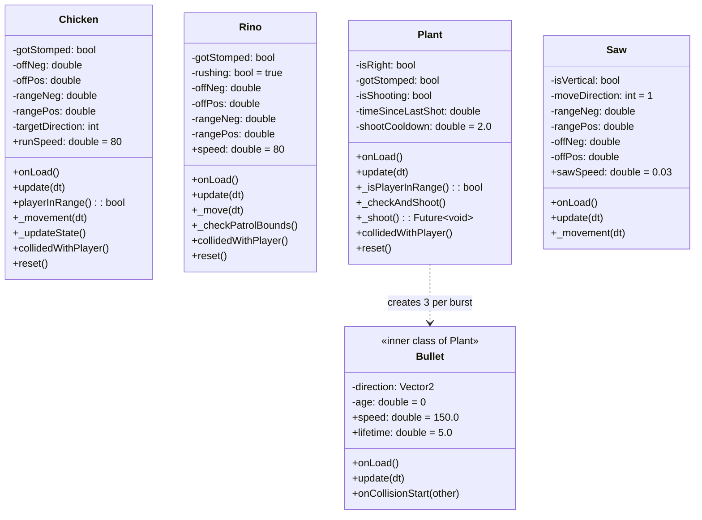
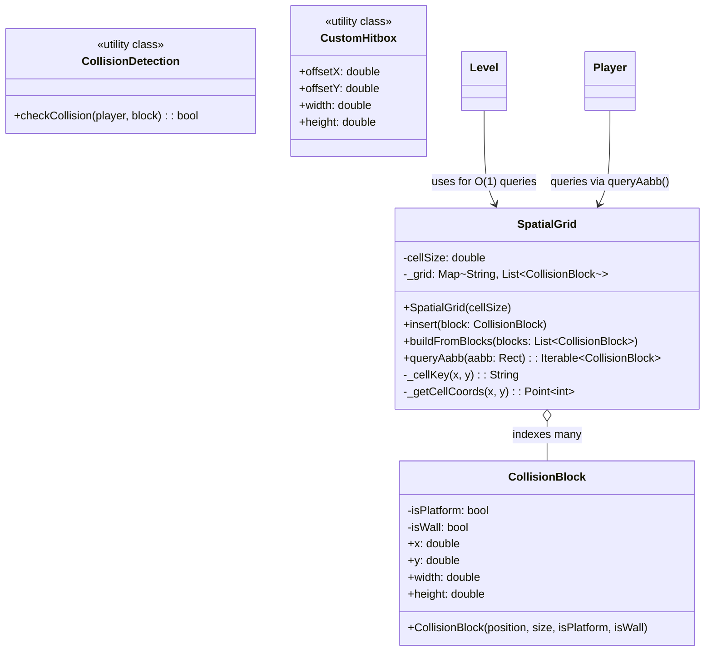

# PixelRunner — Rapport de Projet

## Page de titre
- **Titre du projet**: PixelRunner
- **Équipe**: À compléter
- **Encadrant**: À compléter
- **Semestre**: À compléter
- **Établissement**: À compléter

---

## Résumé / Abstract
PixelRunner est un jeu de plateforme 2D pixellisé développé avec Flutter et Flame, jouable sur mobile, desktop et web. Le joueur parcourt des niveaux, évite des pièges (scies), affronte des ennemis (Chicken, Rino, Plant), collecte des fruits et atteint le checkpoint final. Le projet met l’accent sur des animations fluides, une intégration Tiled pour la création de niveaux, et des mécaniques de tir/interaction (Plant tire trois projectiles en rafales, vers l’avant). Le jeu propose un menu qui premet de sélection de niveaux au démarrage qui de quitter l’application par un simple tap. Résultats: plusieurs niveaux complets, optimisation des performances, réutilisation d’assets, sélection de niveau et écran de fin.

---

## Table des matières
1. [Introduction](#introduction)
2. [Analyse des besoins](#analyse-des-besoins)
3. [Spécifications / Cahier des charges](#spécifications--cahier-des-charges)
4. [Conception et architecture](#conception-et-architecture)
  - [Gestion des collisions (Spatial Grid)](#gestion-des-collisions-spatial-grid)
  - [Sélection de niveau (Menu)](#sélection-de-niveau-menu)
  - [Écran de remerciement](#écran-de-remerciement)
5. [Développement et réalisation](#développement-et-réalisation)
6. [Tests et validation](#tests-et-validation)
7. [Conclusion et perspectives](#conclusion-et-perspectives)
8. [Bibliographie / Références](#bibliographie--références)
9. [Annexes](#annexes)

---

## Introduction
- **Contexte**: Développement d’un jeu 2D multiplateforme, rapide à itérer et facile à distribuer.
- **Problématique**: Proposer des mécaniques classiques (saut, collision, ennemis, tir) avec un pipeline d’assets et de niveaux efficace.
- **Motivation**: Apprentissage de Flutter + Flame, structuration de composants, intégration d’outils (Tiled), et optimisation des performances.
- **Objectifs**: Créer 2–3 niveaux complets, intégrer plusieurs ennemis, gérer le respawn, offrir une sélection de niveaux et un écran de fin.

---

## Analyse des besoins
- **Utilisateurs**: Joueurs casuals sur mobile/desktop; développeurs souhaitant étendre les niveaux.
- **Fonctionnalités attendues**:
  - Déplacement (joystick, bouton saut), collisions, gravité, plateaux.
  - Ennemis variés: Chicken (course), Rino (patrouille), Plant (tir en rafales).
  - Collectibles (fruits), checkpoints, respawn.
  - Sélecteur de niveaux (menu), écran de remerciement.
- **Contraintes techniques**:
  - Flutter + Flame, intégration Tiled (`.tmx`), assets spritesheet.
  - Performances cohérentes: timestep fixe, limitation itérations physiques.
  - Multi-plateforme (Android, iOS, Windows, macOS, Web).

---

## Spécifications / Cahier des charges
### Fonctionnalités minimales
- Déplacement, saut, collisions avec blocs et plateformes.
- Chargement de niveaux via Tiled, par couches et objets.
- Ennemis de base et mort par “stomp”.
- Collecte de fruits et validation du checkpoint.

### Fonctionnalités optionnelles
- Ennemis supplémentaires (Plant avec tir en rafales).
- Sélecteur de niveaux (menu) et écran de remerciement.
- Optimisations (limitation itérations physiques, contrôle des animations).

### Diagramme de cas d’utilisation (Mermaid)


---

## Conception et architecture
- **Choix technologiques**:
  - Multiplateforme via **Flutter**; moteur de jeu **Flame** (sprites, collisions, animations).
  - **Tiled** pour conception des niveaux; assets pixellisés.
  - Audio via **flame_audio** (SFX, BGM).
- **Organisation par composants**:
  - Architecture modulaire avec **classes internes** pour améliorer la cohésion
  - `PixelRunner.dart` (Game principal), `Level.dart` (monde Tiled), `Player.dart`
  - Ennemis: `Chicken.dart`, `Rino.dart`, `Plant.dart` (+ `Bullet` comme classe interne)
  - UI: `MainMenuPage.dart` (+ `MenuButton`, `PixelStar`, `PixelBorder` comme classes internes)
  - UI: `LevelSelection.dart` (+ `LevelCard`, `PixelCharacterIcon`, `BackButton` comme classes internes)
  - IO: `IOComponent.dart` (+ `JumpButton` comme classe interne)
  
- **Principe d'organisation des classes internes**:
  - Les classes auxiliaires étroitement liées à une fonctionnalité sont définies dans le même fichier
  - Avantages: meilleure encapsulation, réduction de la fragmentation, cohésion renforcée
  - Exemples: `Bullet` est interne à `Plant` car elle n'existe que pour les tirs du Plant
  - `JumpButton` est interne à `IOComponent` car elle fait partie du système d'entrée

- **Architecture runtime**:
  - Au démarrage: chargement des images/sons, affichage du `LevelSelectMenu`.
  - Sélection d'un niveau → création de `Level` et `CameraComponent` (résolution fixe 640×360).
  - BGM via `FlameAudio.bgm.play('bgm.mp3')`.
  - Fin de progression → (tap pour quitter).

### Diagramme de composants (architecture)


### Diagramme de classes (Vue d'ensemble)


### Diagramme de classe détaillé (Player et IOComponent)


### Diagramme de classe détaillé (UI Components avec classes internes)


### Diagramme de classe détaillé (Enemies et Projectiles)


### Diagramme de classe détaillé (Physique et Collisions)


### Organisation des classes internes (Architecture fichiers)

Le projet utilise une organisation où certaines classes auxiliaires sont définies comme **classes internes** dans le même fichier que leur classe principale. Cette approche améliore la cohésion et réduit la fragmentation du code:

| Fichier | Classe Principale | Classes Internes | Rôle |
|---------|------------------|------------------|------|
| `IOComponent.dart` | `IOComponent` | `JumpButton` | Gestion des entrées (joystick + bouton) |
| `Plant.dart` | `Plant` | `Bullet` | Ennemi tireur + projectile |
| `MainMenuPage.dart` | `MainMenuPage` | `MenuButton`, `PixelStar`, `PixelBorder` | Menu principal + éléments UI |
| `LevelSelection.dart` | `LevelSelectionPage` | `LevelCard`, `PixelCharacterIcon`, `BackButton`, `PixelStar` | Sélection de niveau + cartes |

**Avantages de cette approche**:
- **Encapsulation forte**: Les classes internes sont étroitement liées à leur conteneur
- **Réduction de la complexité**: Moins de fichiers à naviguer
- **Cohésion**: Logique connexe groupée ensemble
- **Accès simplifié**: Les classes internes peuvent accéder aux membres de la classe parente

**Convention utilisée**:
- Classes internes marquées `<<inner class>>` dans les diagrammes UML
- Notation `<<inner class of Parent>>` pour indiquer la dépendance explicite
- Relation de composition (`*--`) pour montrer que la classe interne fait partie intégrante de la classe parente

### Diagramme de séquence (tir du Plant)


### Diagramme de séquence (initialisation avec SpatialGrid)


### Diagramme de séquence (sélection de niveau)


### Diagramme de séquence (détection collision via SpatialGrid)


---

## Développement et réalisation
- **Modules**:
  - Chargement assets et niveaux (`images.loadAllImages`, Flame/Tiled).
  - Composants ennemis et collisions (`CollisionCallbacks`).
  - Sélecteur de niveaux et écran de remerciement.
  - Physique pas fixe avec garde (limitation des itérations pour éviter spirales de lag).
  - **SpatialGrid**: index des `CollisionBlock` par cellules (O(1) requête par rectangle).
- **Captures d’écran**: À insérer (menu, gameplay, Plant tir).
- **Extraits code significatifs**:
```dart
// Plant: détection verticale + tir vers l’avant (rafale x3)
bool _isPlayerInRange() {
  final playerTop = game.player.y;
  final playerBottom = game.player.y + game.player.height;
  final plantHeadY = position.y;
  final plantBaseY = position.y + height;
  final playerCenterX = game.player.x + game.player.width * 0.5;
  final plantCenterX = position.x + width * 0.5;
  final correctSide = isRight ? (playerCenterX > plantCenterX)
                                 : (playerCenterX < plantCenterX);
  final verticalOverlap = playerBottom > plantHeadY && playerTop < plantBaseY;
  return correctSide && verticalOverlap;
}

void _shoot() async {
  isShooting = true;
  timeSinceLastShot = 0;
  current = PlantState.attack;
  final plantCenter = position + Vector2(width * .5, height * .5);
  final forward = (isRight) ? Vector2(1, 0) : Vector2(-1, 0);
  
  for (int i = 0; i < 3; i++) {
    if (gotStomped || parent == null) break;
    // Création de la classe interne Bullet
    parent?.add(Bullet(position: plantCenter.clone(), direction: forward));
    if (i < 2) await Future.delayed(const Duration(milliseconds: 120));
  }
}

// Classe interne: Bullet - Projectile (définie dans Plant.dart)
class Bullet extends SpriteComponent
    with HasGameReference<PixelRunner>, CollisionCallbacks {
  final Vector2 direction;
  final double speed = 150.0;
  
  Bullet({required Vector2 position, required this.direction});
  
  @override
  void update(double dt) {
    position += direction * speed * dt;
  }
}
```

#### Exemple 2: IOComponent avec classe interne JumpButton
```dart
// IOComponent.dart - Gestion des entrées utilisateur
class IOComponent extends Component with HasGameReference<PixelRunner> {
  late JoystickComponent joystick;
  late JumpButton jumpButton;

  @override
  FutureOr<void> onLoad() async {
    joystick = JoystickComponent(/* ... */);
    add(joystick);
    
    jumpButton = JumpButton(); // Classe interne
    add(jumpButton);
  }
}

// Classe interne JumpButton (dans IOComponent.dart)
class JumpButton extends SpriteComponent
    with HasGameReference<PixelRunner>, TapCallbacks {
  bool isPressed = false;

  @override
  void onTapDown(TapDownEvent event) {
    isPressed = true;
    game.player.hasJumped = true;
  }
}
```

### Organisation du dépôt (structure détaillée)
```
assets/
  audio/ (jump.wav, collect_fruit.wav, hit.wav, bounce.wav, bgm.mp3)
  images/
    Background/ (Blue.png, Brown.png, Gray.png, ...)
    Enemies/ (Chicken, Rino, Plant sprites)
    HUD/ (Joystick.png, Knob.png, JumpButton.png)
    Items/ (Fruits sprites)
    Main Characters/ (Ninja Frog, Mask Dude, Pink Man)
    Menu/
      Buttons/ (Play, Previous, Next, Restart, ...)
      Levels/ (01.png → 50.png - icônes niveaux)
      Text/ (Text (White/Black) (8x10).png)
    Terrain/ (Terrain sprites)
    Traps/ (Saw sprites)
  tiles/ (level_01.tmx, level_02.tmx, pixel_adventure.tsx)

lib/
  main.dart
  PixelRunner.dart (GameState enum + PixelRunner class principale)
  
  Componenets/
    ConstVars.dart (constantes globales)
    
    EntityComponents/
      Level.dart (Level - gestion monde Tiled)
      
      Player/
        Player.dart (Player - personnage jouable)
      
      Enemies/
        Chicken.dart (Chicken - ennemi coureur)
        Rino.dart (Rino - ennemi patrouilleur)
        Plant.dart (Plant + Bullet [inner] - ennemi tireur + projectile)
      
      Collectables/
        Fruit.dart (Fruit - collectible)
      
      Traps/
        Saw.dart (Saw - piège rotatif)
      
      PlatformingElements/
        CollisionBlock.dart (CollisionBlock - blocs de collision)
        Checkpoint.dart (Checkpoint - point de fin de niveau)
    
    IOcomponents/
      IOComponent.dart (IOComponent + JumpButton [inner])
    
    UIcomponents/
      MainMenuPage.dart (MainMenuPage + MenuButton, PixelStar, PixelBorder [inner])
      LevelSelection.dart (LevelSelectionPage + LevelCard, PixelCharacterIcon, BackButton, PixelStar [inner])
    
    PhysicsComponents/
      SpatialGrid.dart (SpatialGrid - optimisation collisions O(1))
      CollisionDetection.dart (utilitaires collision AABB)
      CustomHitBox.dart (hitbox personnalisée)
```

**Légende**: 
- `[inner]` = classe interne définie dans le même fichier
- Fichiers avec classes multiples organisés pour maximiser la cohésion

### Intégration Tiled
- Calques: `SpawnPoints` (player, ennemis, items…), `Collisions` (blocs, plateformes).
- Objets: propriétés lues via `spawnPoint.properties.getValue(...)`.
- Respawn: listes de données (`fruitSpawnData`, `chickenSpawnData`, `plantSpawnData`, ...).

## Gestion des collisions (Spatial Grid)
- **Principe**: grille de taille `tileSize`; insertion des `CollisionBlock` dans les cellules qu’ils recouvrent.
- **Requête**: `queryAabb(Rect)` retourne l’ensemble des blocs dans les cellules intersectées.
- **Complexité**: O(1) en pratique (nombre de cellules constant par hitbox), vs O(n) si parcours naïf.

```dart
// SpatialGrid: construction & requête
final grid = SpatialGrid(cellSize: tileSize);
grid.buildFromBlocks(collisionBlocks);

final rect = Rect.fromLTWH(x, y, w, h);
for (final block in grid.queryAabb(rect)) {
  if (checkCollision(player, block)) {
    // résolution
  }
}
```

### Build & Run
```
flutter run
```

---

## Tests et validation
- **Scénarios de test**:
  - Déplacement/jump sur plateformes; collisions et gravité stables.
  - Stomp sur Chicken/Rino; mort en 1 coup; respawn correct.
  - Plant: tir en rafales (3), détection verticale + côté, projectiles droits.
  - Collecte fruits → checkpoint valide → progression niveau.
  - Menu de sélection: choix niveau et chargement correct.
  - Écran remerciement: affichage et sortie sur tap.
- **Résultats**: Comportements vérifiés sur plusieurs plateformes; performances stables (timestep fixe, itérations capées).
- **Problèmes rencontrés & solutions**:
  - Animations ne se réinitialisaient pas: ajout `reset()` + `animationTicker.reset()`.
  - Saw bloquée: correction des bornes (clamp, inversion).
  - Detection de collision couteuse O(n) => spatial grid (O(1))
  - l'aqusition d'un score supeieur a 1 lors de la detection de la collision avec les fruits: utilisation de OnCollionStart au lieu de OnConllision (detection continue). 

---

## Conclusion et perspectives
- **Bilan**: Objectifs principaux atteints; pipeline d’assets/niveaux maîtrisé; mécaniques clés implémentées.
- **Améliorations**:
  - Plus d’ennemis/obstacles, power-ups, boss.
  - Sauvegarde de progression, scores, classements.
  - Effets sonores/musiques supplémentaires.

---

## Bibliographie / Références
- Flame Engine Docs: https://flame-engine.org
- Flutter Docs: https://docs.flutter.dev
- Tiled Map Editor: https://www.mapeditor.org
- PixelFrog Pixel Adventure assets on itch.io 

---

## Annexes
- Diagrammes UML détaillés.
- Documentation des assets (dimensions sprites, noms de fichiers).
- Captures supplémentaires.
